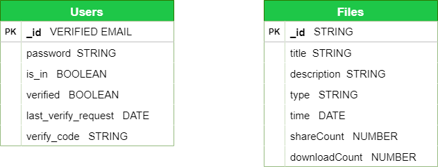

# fileserver
A digital platform where files can be easily accessed and downloaded remotely.

## Project target
To have a system where admins can upload files that can be accessed by users online.     

## Features - (Users)
- **A sign up and login system**: This system is implemented to ensure only registered and authenticated users can access this application.    
- **A password resetting system**: This system is implemented to enable users who forget their password to be verified and allowed to set a new password.
- **Content retrieval**: Users are able to see contents that have been uploded by admin on a feeds page.
- **File search**: Users are able to search for files using the files title and other means. 
- **File downloading**: Users are able to download the files uploaded to the server by admin.
- **File sharing**: Contents can be shared via email to others for downloads.    

## Features - (Admin)
- **File uploads**: Admin is able to upload files to the server, which is latter accessible to users for download online.
- Admin is also able to see the number of times a particular file is downloaded or shared.    

## Project Link
[Live Demo](https://fileserver-8tgg.onrender.com/)    

**NOTE**: This project is currently hosted with limitted resources as the hosting service is free. 
You may experience some seconds of delays especially when it has been inactive for a long time. 

## To log in as Admin
To access the application as the admin, sign in with the following details:    
**Email**: `admin@fileserver.com`    

**Password**: `12345678`    

**NOTE**: Resetting password for Admin has been disabled. This project is an assignment and must be reviewed before anyone who has access can make changes to the Admin account.    

## How To Run App Locally
Run app by first cloning this repo, `git clone https://github.com/KBismark/fileserver.git`    
Navigate to the root director `cd fileserver`   
> ### Installing and Building
> If it's the first time building the app, run `npm run dep-build` to install all dependencies and also build the app at once.        
> Else, after all dependencies have been installed, you can build the app anytime by running `npm run build`   
> 
> **NOTE**: Both dependencies for backend and frontend are installed when you run `npm run dep-build`    
>     
> ### Running the app
> You must have built the app already before it can be ran.    
>
> To run in dev mode, use the command `npm run dev`    
> To run built app, use the command `npm start`. The `ENV_STRING` in the `.env` file must be set to `production` for app to run successfully.        
>

## ER Diagram of Database Design
The database used in this project is MongoDB. The ER below represents the two collections used for this project. The Users colection is used for storing data related 
to registerd users and the Files collection is used for storing uploaded files' related data.    

    

## Implementation
- Backend language: Nodejs    

- Framework: Expressjs    

- Authentication: JSON Web Token (JWT)    

- Database: MongoDB    

- Frontend: Reactjs    
